# Lingling

Free AI models, running through your own machine, in the editor you already use.

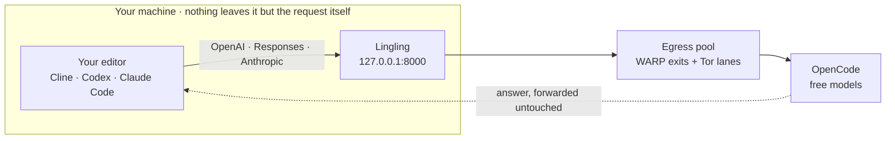

## What this is

You know the frustrating part of free AI tiers? They work beautifully for about
twenty minutes, and then you hit a rate limit mid-task and the whole session
falls apart.

Lingling is a small gateway that sits on your computer. Your editor talks to it
instead of talking to the internet, and it spreads your requests across a pool of
exit IPs so throttling stops being the thing that interrupts you.

|  | |
|---|---|
| **It's yours** | Runs on `127.0.0.1`. No account, no sign-up, nothing phoning home. |
| **It stays out of your way** | Free models come and go; Lingling notices and reroutes on its own. |
| **It doesn't touch the answer** | Upstream bytes are forwarded verbatim. No reformatting, no rewriting. |

## Getting it running

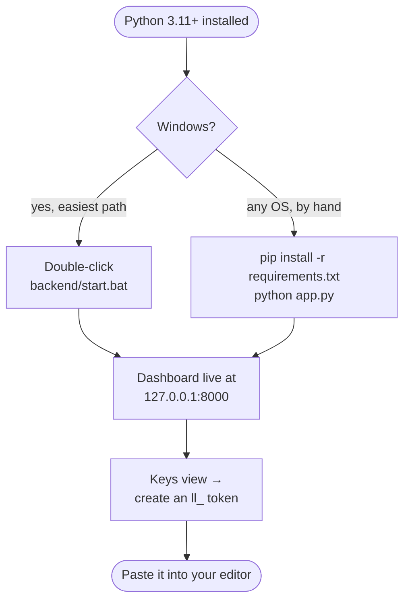

```
cd backend
pip install -r requirements.txt
python app.py
```

`start.bat` does the same thing *and* sets up the egress pool for you. Its
first run downloads the WARP tools plus a ~25 MB Tor bundle, so give it a few
minutes; every run after that starts fast.

Lingling asks for an API key by default. If it's just you on your own machine and
that feels like ceremony, start it with `LINGLING_REQUIRE_KEY=0` and skip the key
step entirely.

## Pointing your editor at it

Three clients, three wire formats, one gateway. The base URL is the thing people
get wrong most often, so here it is up front:

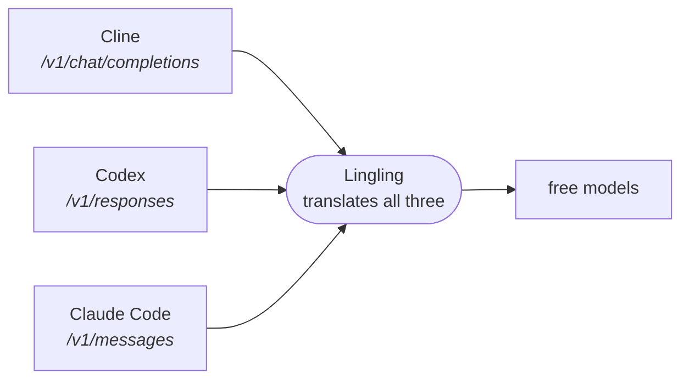

| Client | Base URL | One-click setup |
|---|---|---|
| Cline / any OpenAI client | `http://127.0.0.1:8000/v1` | — |
| Codex | `http://127.0.0.1:8000/v1` | `setup_codex.bat` |
| Claude Code | `http://127.0.0.1:8000` &nbsp;**← no `/v1`** | `setup_claude_code.py` |

### Cline, or anything else that speaks OpenAI

Four fields and you're connected:

| Setting | Value |
|---------|-------|
| Provider | OpenAI Compatible |
| Base URL | `http://127.0.0.1:8000/v1` |
| API key | your `ll_...` token |
| Model | any free model, or `lingling-auto` to let Lingling choose |

### Codex

Codex only speaks the newer Responses API these days, so its provider block
points at the gateway and Lingling does the translating.

The easy route is `setup_codex.bat` in the repo root. Double-click it and it
refreshes the model catalog, writes `~/.codex/config.toml`, and sorts out the API
key — reusing one you've already issued, or minting a fresh one. There's nothing
after that.

If you'd rather do it by hand, `~/.codex/config.toml` wants to look like this:

```toml
model_provider = "lingling"
model = "lingling-auto"

[model_providers.lingling]
name = "Lingling"
base_url = "http://127.0.0.1:8000/v1"   # codex appends /responses; keep /v1
wire_api = "responses"
env_key = "LINGLING_API_KEY"
```

Then set the key in your terminal before running `codex` (you can drop `env_key`
altogether if you're running with `LINGLING_REQUIRE_KEY=0`):

```
set LINGLING_API_KEY=ll_your_token
```

One extra wrinkle: for the reasoning dial to actually reach the model, Codex
needs the model declared in its own catalog. `python tools\codex_catalog.py`
writes that file from the live model list and wires the `model_catalog_json` line
into your config for you. Worth re-running after a Codex upgrade, or whenever new
free models turn up.

### Claude Code

Claude Code speaks Anthropic's API rather than OpenAI's, so it gets its own
endpoint.

The gentlest way in is the setup window — double-click `setup_claude_code.py`.
It reads the model list from your running gateway, reuses or mints a key, writes
`~/.claude/settings.json`, and cleans out any stale `provider` block left behind
by an older gateway. Then run `claude`. No environment variables to remember.

By hand, the thing to watch is that this base URL has **no `/v1`** on the end —
Claude Code adds it itself:

```
set ANTHROPIC_BASE_URL=http://127.0.0.1:8000
set ANTHROPIC_AUTH_TOKEN=ll_your_token
```

Model and thinking depth live in the terminal: `/model` and `/effort` change them
per session. Lingling reads the depth off every request and clamps it to whatever
the routed model can genuinely handle.

If you leave the model unset, Claude Code asks for its usual `claude-sonnet-…`
names. Those map onto whatever's free by size class:

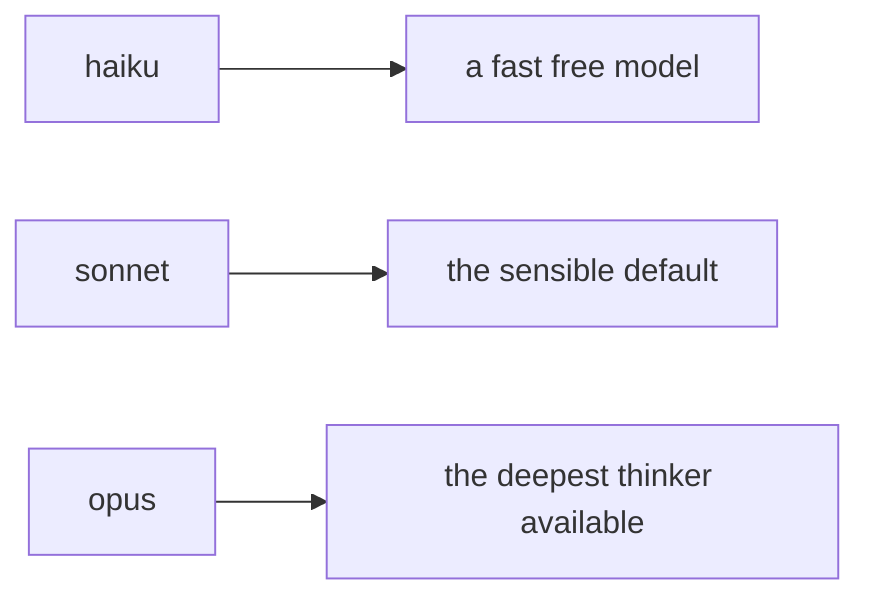

Its background title-and-summary calls travel the same path, so nothing 404s
behind your back.

---

## Which models you get

Whatever's free right now. There's deliberately no model table in this README,
because any list would be wrong within a month. The catalog is fetched from the
upstream at runtime, while a small configurable retired-model seed prevents known
dead listings from appearing on a fresh install.

The dashboard's **Catalog** view is the live answer. Everything below is how it
stays live:

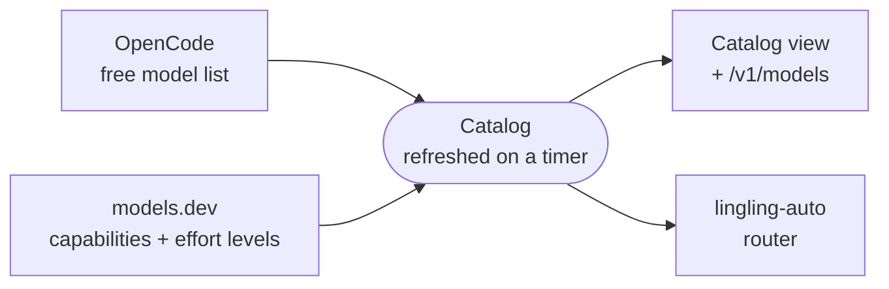

Model ids, context sizes, capabilities, and effort levels are discovered from the
upstream catalog and models.dev metadata. The dispatcher model and retired-model
seed are configuration defaults, not a frozen catalog. New free models appear on
the next refresh; retired ones drop out. A model that vanishes mid-request fails
over to another free one.

### The retirement cycle

Upstream sometimes keeps advertising a model it no longer actually serves — the
list says free, the chat says no. The first request that hits a 400 retires the
model **regardless of the listing**. It stays hidden for a probation window,
after which the catalog's self-heal can resurrect it on a live re-list, because
OpenCode has restored free tiers before:

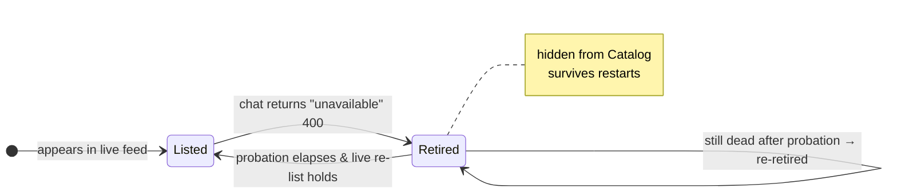

The five-minute probation window (`LINGLING_RETIRED_MODEL_PROBATION_S`) replaced
the older "trust `/models`" gate, which kept chronic offenders (still listed but
the upstream keeps refusing chat — the deepseek/musespark case) perpetually
routable. A model that just 400'd once rides out a transient blip in five
minutes instead of the seven-day lockdown the old design used to lock out
working models for; a chronic offender cycles parked → retried → re-parked once
per window until opencode actually restores the chat.

`LINGLING_RETIRED_MODEL_TTL_DAYS` (7 days) is now the upper-bound age cap — a
retired entry older than this is dropped on a fresh gateway start. Probation
re-parks reset the timer, so a chronic offender that keeps cycling never ages
out; the TTL only garbage-collects entries that genuinely went idle for over a
week. Models already known to be gone are pre-seeded as retired
(`LINGLING_RETIRED_MODELS`) so they never list even once.

## Reasoning effort

Most editors let you dial in how hard a model thinks before answering. Two things
make that messy: every editor invents its own vocabulary, and only some models
have the dial at all.

Lingling puts every word on one 0–1 scale, then picks the nearest level the target
model actually publishes:

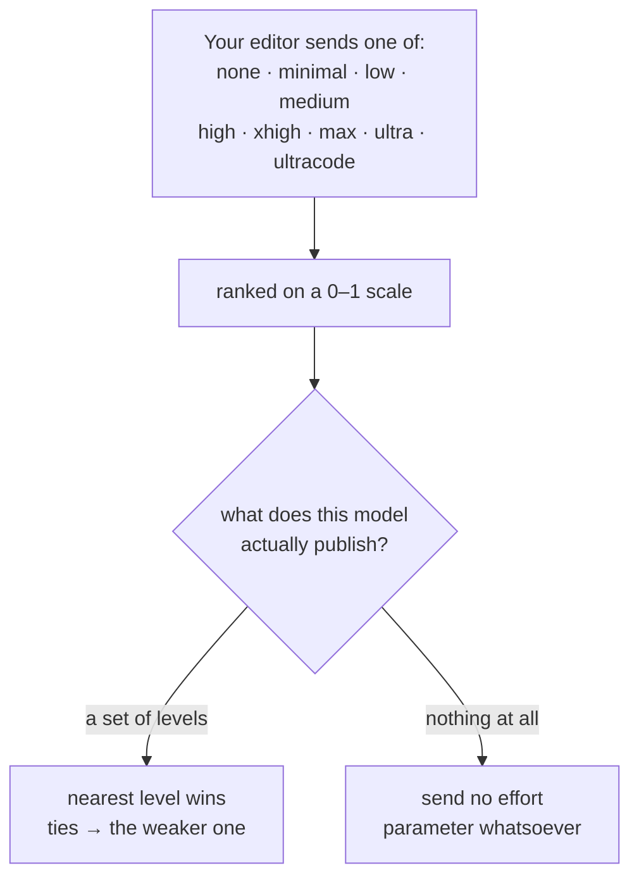

Two rules fall out of that. Ask below a model's floor and you get its floor. When
two levels are equally close, the weaker one wins — so the gateway never spends
more thinking than you asked for.

The right-hand branch matters more than it looks. OpenCode returns **200 for an
effort value a model doesn't implement**, silently ignoring it, so sending a level
to a model without the dial looks like success while changing nothing. Lingling
sends nothing instead of sending something for show.

Where the levels come from: models.dev's `reasoning_options`, the same data
OpenCode's CLI shows under `/variants`. So a model that publishes no levels today
runs on its own default, and the moment it publishes real ones they take effect on
the next refresh. Codex shows a single `default` rung for such models; Cline and
direct API calls pass the field through as you sent it.

---

## The dashboard

Open http://127.0.0.1:8000. Five views down the left rail:

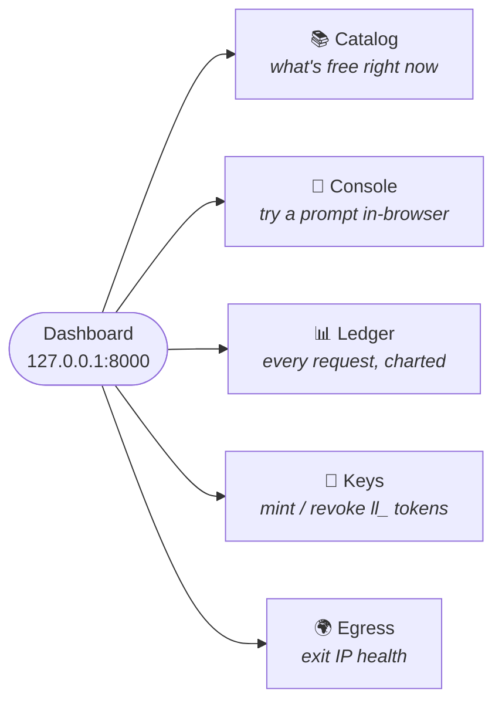

The Ledger is the fun one — a board of live blocks you rearrange to taste:

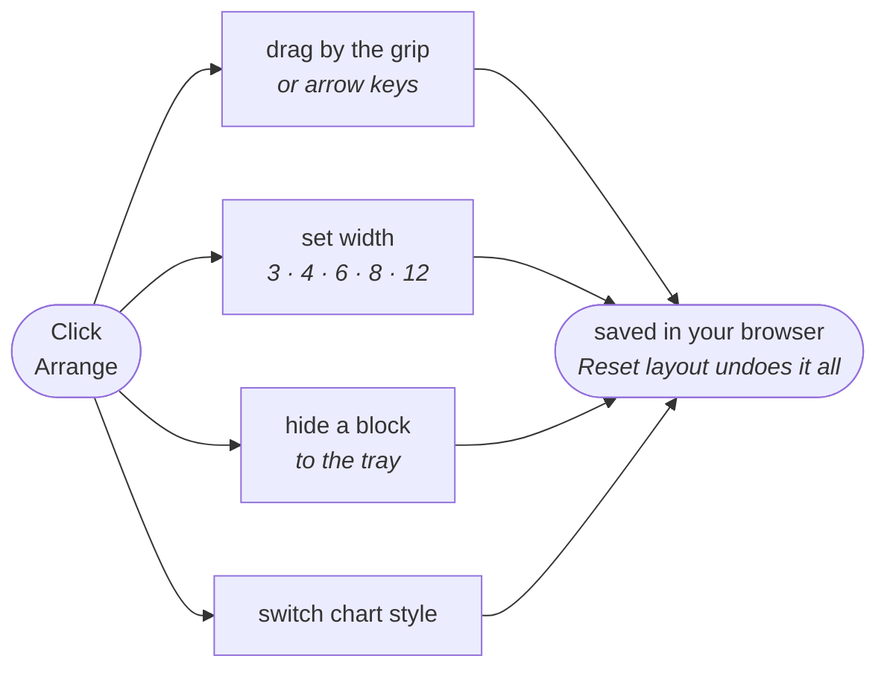

Chart styles are offered wherever more than one reading makes sense — activity as
area, line, or bars; latency as bars, curve, or cumulative; share and outcomes as
bars, donut, or stacked.

## Configuration

All environment variables, all with defaults tuned for a local single-user
gateway. Skip this section unless something specific needs changing.

**Where it listens**

| Variable | Default | Meaning |
|----------|---------|---------|
| `LINGLING_HOST` / `LINGLING_PORT` | `127.0.0.1` / `8000` | Where `python app.py` binds |
| `LINGLING_REQUIRE_KEY` | `1` | Gate API clients behind a `ll_` key |
| `LINGLING_ALLOWED_ORIGINS` | *(empty)* | Extra CORS origins, comma-separated |
| `LINGLING_DATA_DIR` | `backend/data` | Where the keyring, usage DB and WARP identities live |

**Timeouts and refresh**

| Variable | Default | Meaning |
|----------|---------|---------|
| `LINGLING_REQUEST_TIMEOUT` | `120` | Upstream request timeout (s) |
| `LINGLING_CATALOG_TTL` | `600` | How often the model list refreshes (s) |
| `LINGLING_EGRESS_WAIT_BUDGET` | `120` | Max seconds to wait for a cooled egress pool |
| `LINGLING_STREAM_IDLE_TIMEOUT` | `90` | Treat a silent stream as broken after this (s) |

**Egress pool**

| Variable | Default | Meaning |
|----------|---------|---------|
| `LINGLING_WARP_COUNT` | `10` | How many WARP identities to register (slots; lanes = distinct exits the PoP offers) |
| `LINGLING_PROBE_ON_STARTUP` | `1` | Send a real model request through each WARP proxy at startup to detect rate-limited/dead IPs |
| `LINGLING_PROBE_INTERVAL_S` | `300` | The daemon re-runs the real-model probe + healers on this cadence |
| `LINGLING_WARP_FORM_ON_STARTUP` | `1` | Assemble distinct exit lanes after the startup probe |
| `LINGLING_TOR_ENABLED` | `1` | Run Tor egress lanes beside WARP (zero-account exit IPs; first run downloads Tor itself) |
| `LINGLING_TOR_COUNT` | `3` | How many Tor lanes to run (each is one random exit IP; a restart rotates it) |
| `LINGLING_WARP_ENDPOINTS` | curated list | Cloudflare edges used for tunnel re-rolls (comma-separated) |
| `LINGLING_PROBE_MODEL` | *(a free model)* | Model used for the startup probe |
| `LINGLING_PROBE_TIMEOUT` | `15` | Timeout (s) for each startup probe request |
| `LINGLING_PROBE_CONCURRENCY` | `6` | Lanes probed at once (each lane first passes a raw SOCKS5 liveness check with a hard timeout, so a silent tunnel can't stall the pass) |
| `LINGLING_PROBE_SOCKS_TIMEOUT` | `8` | Hard budget (s) for the raw SOCKS5 handshake pre-check — httpcore's own handshake can't be timed out by httpx, so this bounds a lane that accepts TCP but never answers |
| `LINGLING_PROBE_TRACE_TIMEOUT` | `8` | Budget (s) for the exit-IP trace fetch through an already-verified lane |
| `LINGLING_PROBE_CAP_SLACK` | `12` | Slack (s) on top of a lane's worst case that forms the per-lane watchdog deadline |

**Model availability**

| Variable | Default | Meaning |
|----------|---------|---------|
| `LINGLING_RETIRED_MODELS` | *(seeded list)* | Models hidden from the catalog from startup — dropped free models the upstream still advertises |
| `LINGLING_RETIRED_MODEL_PROBATION_S` | `300` | A runtime-retired model stays hidden this many seconds before the catalog self-heal can resurrect it on a live `/models` re-list; the window that replaced the old "trust `/models`" gate |
| `LINGLING_RETIRED_MODEL_TTL_DAYS` | `7` | Upper-bound age cap — a retired entry older than this is dropped on a fresh gateway start (probation re-parks reset the timer, so chronic offenders never age out) |
| `LINGLING_UPSTREAM_USER_AGENT` | `opencode/1.0` | Identifies as the official client. See below — without this, the best free models 429 instantly |

The complete list lives in `backend/core/config.py`, defaults included. Everything
is read at startup, so a change means a restart.

---

## How requests find their way

Name a model and that's the model you get. Send `lingling-auto` and the choice is
made for you:

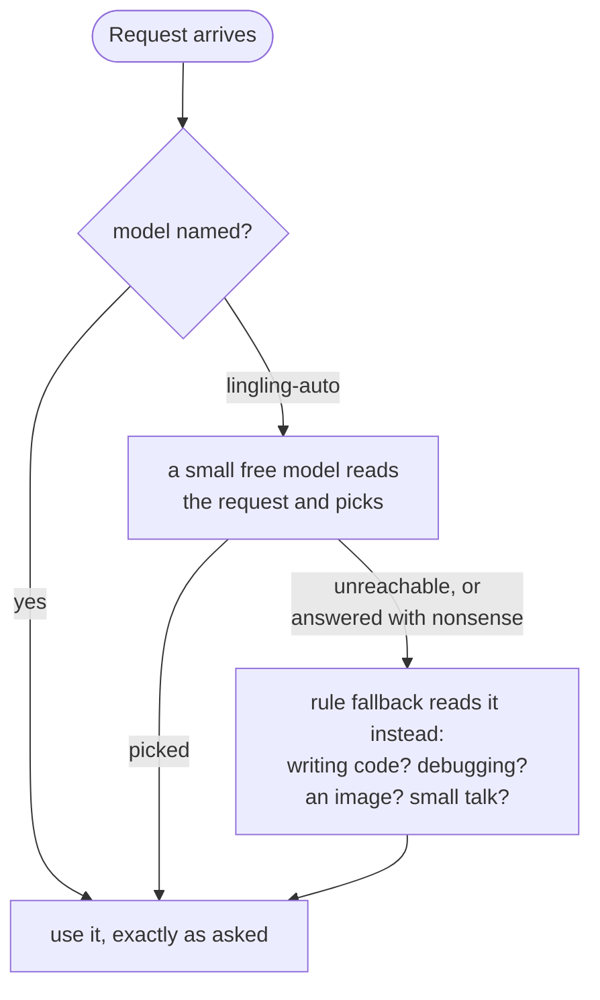

Between the two, a request is never dropped and never lands on the wrong kind of
model.

### Failover, in layers

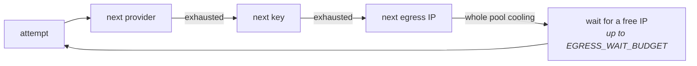

That last box is a deliberate choice. When the entire egress pool is cooling at
once, the request *waits* instead of dying with a 503 — a 503 makes Cline or Codex
abandon the whole task, which is far worse than a pause. SSE keepalives go out
while it waits so your client doesn't conclude the connection hung.

### The User-Agent story

This is the single most surprising thing in the codebase, so it's worth the
paragraph.

Every upstream request identifies itself as the official OpenCode client via its
`User-Agent`. The best free models are gated behind that header — send anything
else and you get an instant `FreeUsageLimitError` 429 on the very first call:

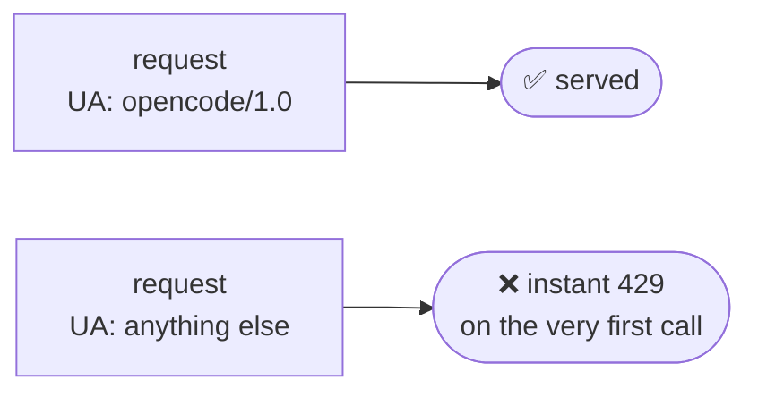

No amount of quota or IP rotation changes that outcome. Which is the whole reason
rotating egress IPs never unlocked those models: the wall was never the IP, it was
the User-Agent. The lighter free models don't check it, which is precisely why
they kept working while the good ones stayed stubbornly shut.

### When a stream breaks

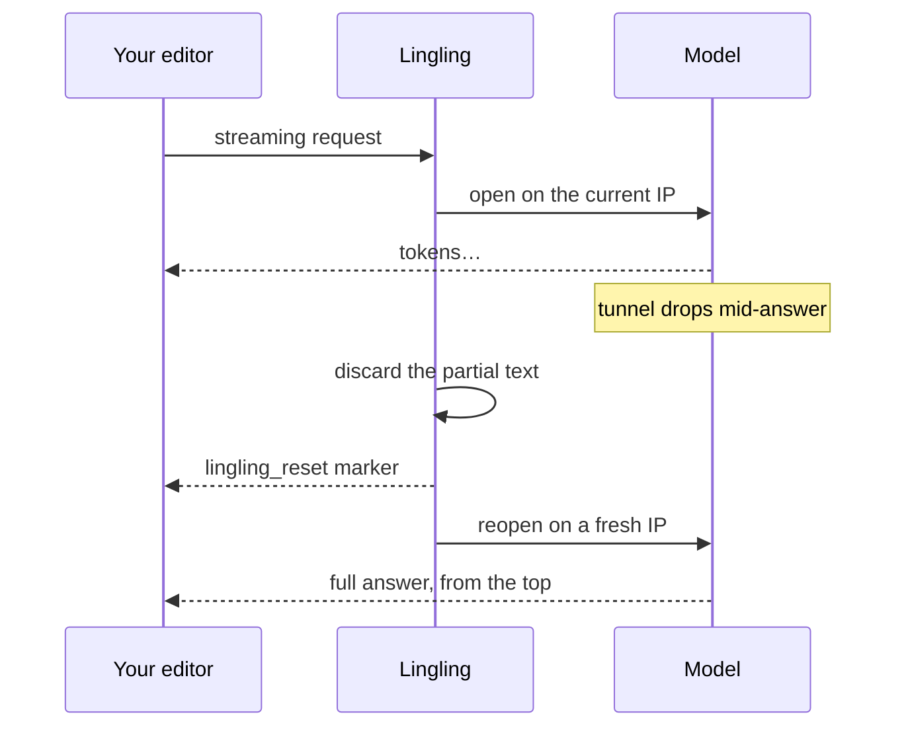

The `lingling_reset` marker is the important part — it tells your client to throw
away the half-finished answer rather than gluing the new one onto it. One retry,
then it gives up honestly.

Because the retry re-decides the model too, an auto-routed request can change model
mid-turn. One where you named a model never will.

A stream that goes quiet *without* dying is a different failure, and gets cut off
after `LINGLING_STREAM_IDLE_TIMEOUT` rather than hanging your session forever.

### The egress pool: lanes, not lies

Nothing here needs your attention; it's listed so you know what the Egress
view is showing you. But one fact first, because it's easy to get wrong:
**a WARP identity is not an exit IP.** Your local Cloudflare PoP owns a small
set of public exits — on the network this was built on, somewhere between two
and five depending on the hour — and every tunnel lands on one when it comes
up. Ten identities can share one address. So Lingling counts what actually
carries traffic, **lanes**, and assembles them from two free sources that
need no account:

| Source | Default | Distinct exits | Rotation |
|---|---|---|---|
| **WARP** | 10 slots | 2–5 — whatever your Cloudflare PoP offers right now | tunnel re-roll (~4s, no re-registration) |
| **Tor** | 3 lanes | one per lane, always distinct | restart the lane (~seconds, fresh route) |
| **Any SOCKS proxy** | — | one per proxy you add | yours |

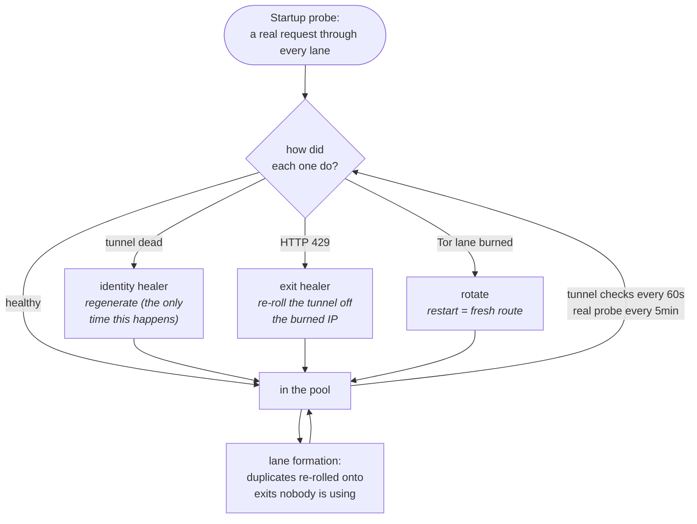

Three mechanics keep the lanes real:

* **A learned edge→exit map.** Which exit a WARP tunnel gets depends on which
  Cloudflare edge it enters through. Every roll is recorded, so healing and
  formation aim at known edges instead of re-rolling blind.
* **Re-roll, don't re-register.** A burned exit heals by re-establishing the
  tunnel — free and seconds. Cloudflare registrations are only spent when a
  tunnel is genuinely dead, and OpenCode quota is never spent placing lanes
  (verification runs through Cloudflare's own endpoint).
* **Truth on the dashboard.** The Egress view shows each lane's exit IP and a
  live **exit lanes** count — "5 slots on 1 address" can never masquerade as
  "5 exits" again. When every lane is burned at once, the healer waits on the
  upstream's reset window instead of churning, and held requests get SSE
  keepalives so your client doesn't give up.

Want more lanes? Raise `LINGLING_TOR_COUNT` (each Tor lane is one always-
distinct exit at ~63 MB RAM), or add any SOCKS5 proxy from the dashboard —
each is one guaranteed lane.

## Where things stand

Everything in this README describes implemented behavior, not a roadmap. The test
suite currently collects 200 tests, including hermetic unit tests and optional live
integration checks against the real free tier. The hermetic suite is the repeatable
deployment gate; live checks require network access and an available upstream tier.

From the repository root, run the repeatable suite from `backend` so the package
imports resolve correctly:

```text
cd backend
python -m pytest tests/ -q
```

The launcher creates local runtime state under `backend/data/`. That directory is
ignored by Git and must not be copied into a release: it can contain issued API
keys, usage history, WARP identity keys, Tor state, and downloaded binaries. A
fresh download creates an empty state directory on first start.

One security note worth stating plainly: the WARP bootstrap, the Tor download
and both one-click setups fetch their tools over verified TLS only, and a
failed download never quietly disables certificate checking process-wide.

---

## Under the hood

`backend/app.py` is the whole gateway. Here's how the pieces sit relative to each
other:

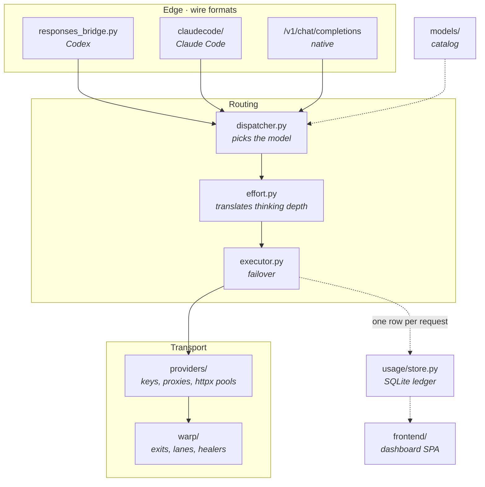

| Piece | Location | Job |
|-------|----------|-----|
| Providers | `backend/providers/` | OpenCode transport, key pool, egress proxy pool, pooled httpx clients |
| Catalog | `backend/models/` | Merges free models + live capabilities (models.dev) |
| Dispatcher | `backend/routing/dispatcher.py` | `lingling-auto` model choice + rule fallback |
| Executor | `backend/routing/executor.py` | Failover across providers/keys/IPs |
| Effort | `backend/routing/effort.py` | Rank-based effort translation |
| Codex bridge | `backend/routing/responses_bridge.py` | Responses ↔ chat completions |
| Claude bridge | `backend/claudecode/` | Anthropic Messages ↔ chat completions |
| WARP | `backend/warp/manager.py` | WARP identity lifecycle + tunnel re-rolls |
| Tor lanes | `backend/warp/tor_egress.py` | Zero-account Tor exit lanes |
| Probe + healers | `backend/warp/probe.py` | Real-model probe, exit healer, lane spreading |
| Egress map | `backend/warp/egress_map.py` | Learned Cloudflare edge → exit map |
| Lane formation | `backend/warp/formation.py` | Assembles distinct exits on purpose |
| Health daemon | `backend/warp/health.py` | Periodic checks, healing, probe cadence |
| Usage | `backend/usage/store.py` | SQLite request ledger |
| Dashboard | `frontend/` | Single-page app |

### Endpoints

🔓 open · 🔒 needs a key

| Method | Path | | Purpose |
|--------|------|---|---------|
| GET | `/` | 🔓 | Dashboard + session cookie |
| GET | `/api/health` | 🔓 | Liveness + provider/catalog/pool summary |
| GET | `/v1/models` | 🔓 | OpenAI-compatible model list |
| POST | `/v1/chat/completions` | 🔒 | Main router |
| POST | `/v1/responses` | 🔒 | Codex (Responses wire format) |
| POST | `/v1/messages` | 🔒 | Claude Code (Anthropic wire format) |
| GET | `/api/models` | 🔒 | Catalog + router entry |
| GET | `/api/usage` · `/api/usage/since/{id}` | 🔒 | Ledger feed |
| GET/POST/DELETE | `/api/keys` | 🔒 | Issue / list / revoke `ll_` keys |
| GET/POST | `/api/proxies` | 🔒 | Egress pool status / add |
| GET | `/api/warp` | 🔒 | WARP status |
| POST | `/api/warp/setup\|start\|stop\|refresh` | 🔒 | WARP lifecycle |
| GET/POST | `/api/warp/probe` | 🔒 | Latest real-model probe / run it now |
| POST | `/api/warp/formation` | 🔒 | Assemble distinct exit lanes now |

### Auth

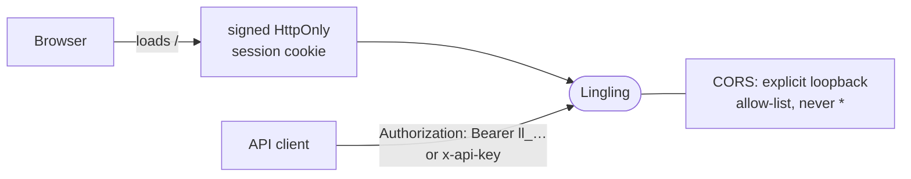

Sessions don't survive a restart, because the signing secret is generated per
process. That's deliberate and harmless — the page re-fetches `/` and picks up a
new one.

### What Lingling does and doesn't touch

Upstream bytes are forwarded untouched. No re-spacing, no rewriting, no
"improving" the model's answer. Only two things happen at the edge: token counts
are read off each SSE line so a streamed request still lands in the ledger, and the
Codex and Claude bridges translate request and response shapes for those two
clients, because they speak different dialects.

---

## License

See [LICENSE](LICENSE). Free to use and run; may not be sold, or redistributed in
modified form. Copyright (c) 2026 huranth.
